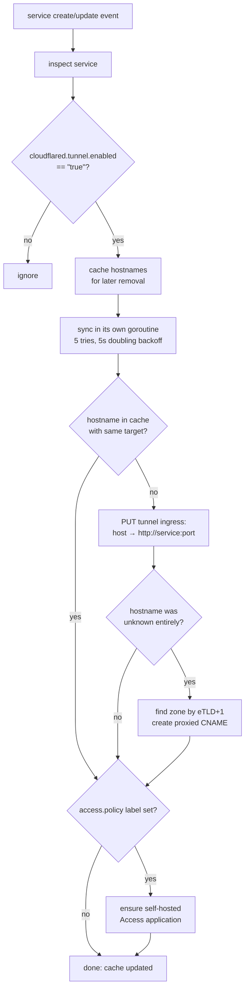
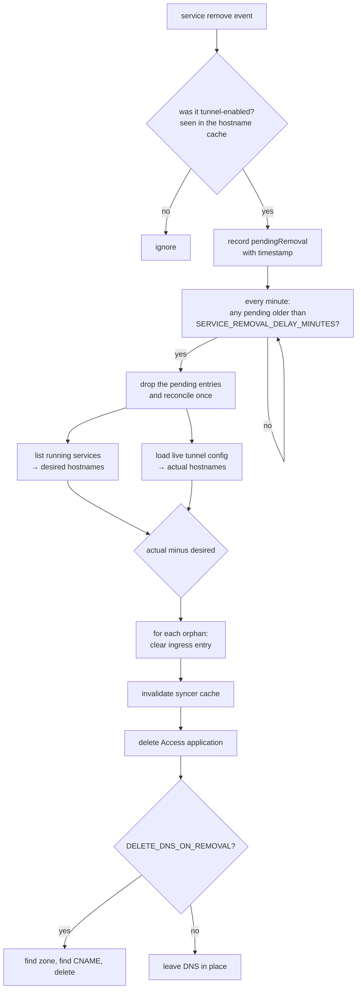

## The workers

`Server.Start()` binds the HTTP listener and launches five long-lived
goroutines. All of them share the server context; `Shutdown` cancels it and
waits for every one to return.

| Worker | What it watches | What it does |
|---|---|---|
| `service-events` | Docker `service create` / `update` | Syncs tunnel ingress, DNS, and Access apps for tunnel-enabled services. |
| `service-removals` | Docker `service remove` | Records a pending removal, if the service was known to be tunnel-enabled. |
| `container-events` | Docker container `die` / `restart` / `crash` | Sends a shoutrrr notification, deduped per container. |
| `event-cleanup` | a 5-minute ticker | Evicts container-event dedup entries older than 10 minutes. |
| `removal-processor` | a 1-minute ticker | Promotes ripe pending removals into a reconciliation pass. |

Each event watcher is a single goroutine around one subscription. If Docker
closes the stream, the watcher logs it, waits 5 seconds, and re-subscribes in
the same loop — it does not spawn a replacement goroutine, so watchers never
multiply after a daemon restart.

## The sync path

The syncer keeps an in-memory `hostname → target` cache, loaded lazily from the
live tunnel config on the first sync. It is the thing that makes repeat events
cheap: an unchanged service costs one map lookup and no Cloudflare calls.

Syncing runs off the event loop, so a slow or failing Cloudflare API cannot
stall the processing of other service events. A failing sync retries 5 times
with 5s, 10s, 20s, 40s gaps, then gives up until the next event for that
service. Successes and failures land in
`swarmctl_cloudflare_sync_total{status}`.

### Editing tunnel ingress

Cloudflare's tunnel configuration API is whole-document: there is no "add one
rule" call. Every write therefore reads the current config, rebuilds the ingress
list, and PUTs it back:

1. the hostname being written goes first (omitted entirely when the target is
   empty, which is how removal works),
2. all other existing entries are carried through untouched — including
   externally managed ones,
3. the `http_status:404` catch-all is dropped from wherever it was and
   re-appended last, because Cloudflare requires the catch-all to be the final
   rule.

That read-modify-write is guarded by a mutex inside the client, so the event
path and the reconciler cannot clobber each other's updates.

### DNS

A new hostname gets a proxied `CNAME` to `<tunnel-id>.cfargotunnel.com` with
TTL `1` (automatic). The zone is found by taking the effective TLD+1 of the
hostname (`app.example.com` → `example.com`) and listing zones with that name in
the configured account. Creation is idempotent: an exact-name CNAME that already
exists short-circuits the call, so a recreated service does not produce
duplicates.

## Container events

`die`, `restart`, and `crash` events become shoutrrr notifications containing
the container name, short ID, and exit code, delivered to every URL in
`NOTIFICATION_URLS` (nothing is sent when it is unset). Each
`containerID:action` pair is
remembered for a 1-minute cooldown, so a crash-looping container produces at
most one push a minute rather than one per restart. The cleanup worker sweeps
entries older than 10 minutes every 5 minutes, and the current map size is
exported as `swarmctl_recent_events_count` (computed when `/metrics` is
scraped).

## Removal reconciliation

Removals are handled by convergence, not by remembering what each service owned.

Two consequences worth internalising:

- **The delay is deliberate.** A `docker stack deploy` that recreates a service
  emits a remove followed by a create. Reconciling immediately would tear down
  ingress for a service that is about to come back. The default 30 minutes is
  generous; shorten it with `SERVICE_REMOVAL_DELAY_MINUTES` if your deploys are
  never that slow.
- **Reconciliation is global, not per-service.** Whatever triggers a pass, the
  pass compares *all* running tunnel-enabled services against the *entire* live
  tunnel config and removes every hostname nothing claims. So a hostname you
  dropped from a still-running service also disappears — on the next pass, not
  when you dropped it.


Anything else that puts a hostname in this tunnel's ingress — a manual dashboard
edit, another tool — looks like an orphan to the reconciler and will be removed
the next time a pass runs. Give externally managed hostnames their own tunnel.


By default only the ingress entry and the Access application go away; the DNS
record is left pointing at the tunnel, where it resolves to Cloudflare's 404
catch-all. Set `DELETE_DNS_ON_REMOVAL=true` to delete the record too.

## Logging

`slog` with a JSON handler on stdout at the configured level, and nothing on top
of it — collecting and routing logs is left to whatever already scrapes your
containers. Every line carries `service=swarmctl` and `env=$ENVIRONMENT`.
Alerting is separate, through `NOTIFICATION_URLS`.
